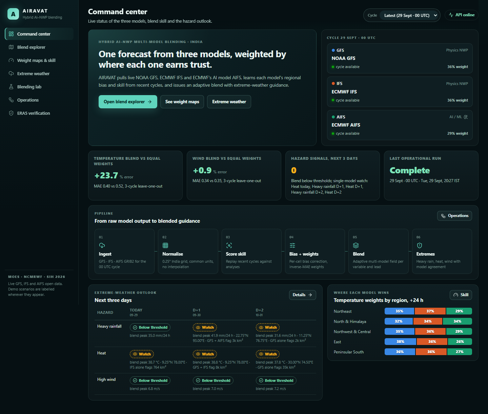
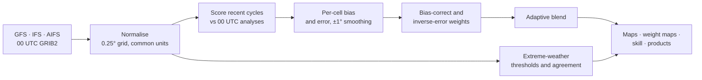
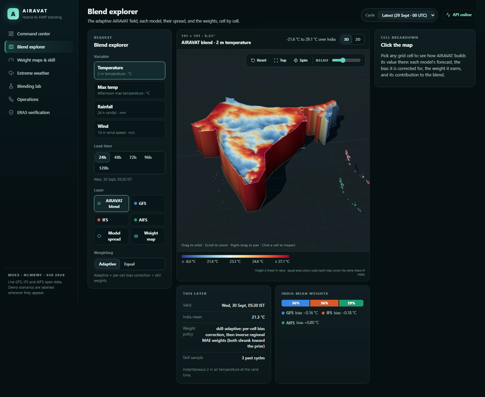
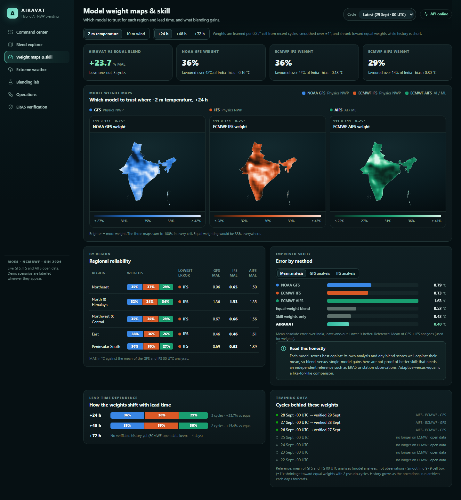
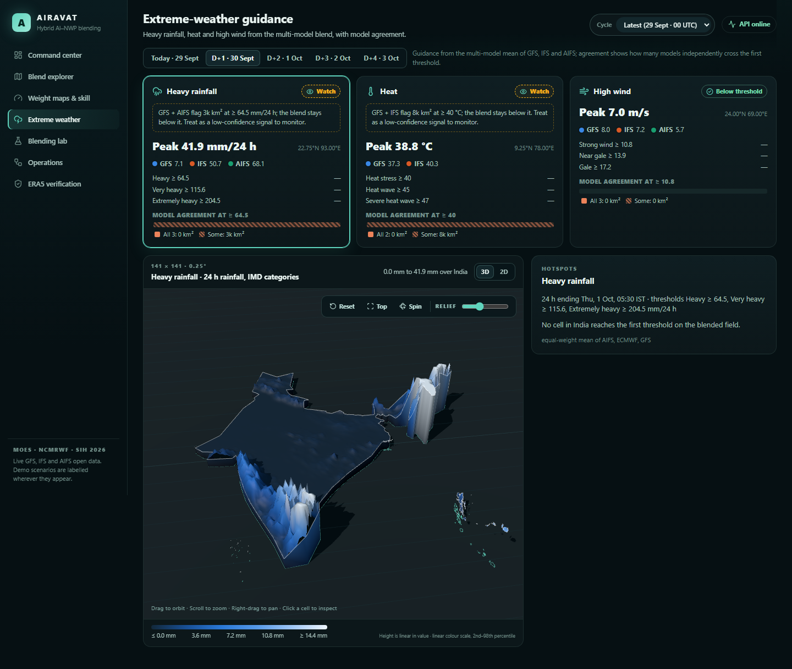
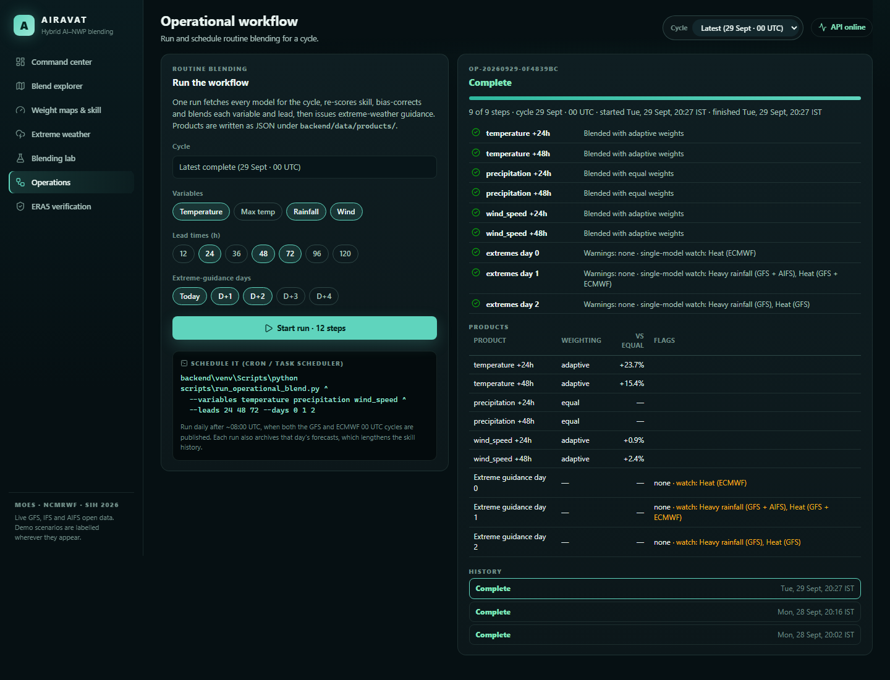

# AIRAVAT

**Hybrid AI–NWP multi-model forecast blending for India.**
AIRAVAT pulls live forecasts from two physics-based weather models and one AI weather model. It learns where each one is reliable and issues a single adaptive forecast, with model weight maps and extreme-weather guidance.

Built for **Smart India Hackathon 2026**. Problem statement *Hybrid AI–NWP Multi-Model Forecast Blending System*, from the Ministry of Earth Sciences (MoES) / NCMRWF. Theme: Disaster Management.



---

## Contents
- [What it delivers](#what-it-delivers)
- [Forecast sources](#forecast-sources)
- [How the blending works](#how-the-blending-works)
- [Screenshots](#screenshots)
- [Quick start](#quick-start)
- [Operational workflow](#operational-workflow)
- [API](#api)
- [Project structure](#project-structure)
- [Testing](#testing)
- [Limitations](#limitations)
- [Phase 1.5 demo pipeline](#phase-15-demo-pipeline)

## What it delivers

| Expected outcome | How AIRAVAT delivers it |
|---|---|
| **Dynamically blended forecast** | **Blend explorer**: the adaptive blend on a 0.25° India grid as an interactive 3D or 2D map. Click any grid cell to see each model's raw value, its bias correction, its weight and its contribution. |
| **Model weight maps** | **Weight maps & skill**: one weight map per model, a region-by-region reliability table, and how the weights shift with lead time. |
| **Improved forecast skill** | Leave-one-out error of the adaptive blend vs the equal-weight blend and each single model, reported against three references. |
| **Extreme-weather guidance** | **Extreme weather**: heavy rainfall (IMD categories), heat and high wind for today through day +4. Shows affected area, peak location, how many models agree, and "watch" flags where only one model sees an extreme. |
| **Operational workflow** | **Operations** page plus `scripts/run_operational_blend.py` for cron or Windows Task Scheduler. Every run is logged and writes JSON products. |

**Variables:** 2 m temperature, afternoon maximum temperature, 24 h rainfall, 10 m wind speed.
**Domain:** 5–40°N, 65–100°E at 0.25° (141 × 141 cells), clipped to India. Lead times up to 120 h.

## Forecast sources

| Source | Type | Access |
|---|---|---|
| NOAA **GFS** | Physics NWP | NOMADS 0.25° filter service |
| ECMWF **IFS** | Physics NWP | ECMWF open data; the needed GRIB messages are fetched by HTTP byte range |
| ECMWF **AIFS** | AI / machine-learning model | ECMWF open data (`aifs-single`) |

All three are free and need no API key. Downloaded GRIB files are cached under `backend/data/`.

## How the blending works



1. **Score.** For each recent cycle, compare every model's forecast with the mean of the GFS and IFS analyses at the valid time.
2. **Learn per cell.** Compute each model's bias (mean error) and mean absolute error (MAE) in every grid cell, smoothed over ±1°.
3. **Correct and weight.** Subtract each model's bias, then weight it in proportion to 1 / MAE. While history is short, both are pulled toward the neutral starting point: zero bias and equal weights.
4. **Evaluate fairly.** Skill is scored leave-one-out: each day is blended using weights learned only from the other days.

Example from the 29 Sep 2026 cycle (2 m temperature, +24 h, 3 past cycles): the adaptive blend's MAE was **0.40 °C** against **0.52 °C** for an equal-weight blend, **23.7% lower**. These numbers change with every cycle; the **Weight maps & skill** page shows the current ones.

Rainfall and maximum temperature have no analysis to score against, so they use equal weights until an observed reference is added.

## Screenshots

| Blend explorer | Weight maps & skill |
|---|---|
|  |  |
| **Extreme weather** | **Operations** |
|  |  |

## Quick start

**Needs:** Python 3.11+, Node.js 20+, and internet access for the live model data.

### 1. Backend
```bash
cd backend
python -m venv venv
venv\Scripts\activate              # macOS / Linux: source venv/bin/activate
pip install -r requirements.txt
copy .env.example .env             # macOS / Linux: cp .env.example .env
python -m uvicorn app.main:app --host 127.0.0.1 --port 8000
```
- If port 8000 is already in use, use another port, for example `--port 8001`.
- Don't use `--reload` on Windows: its worker process can hang while decoding GRIB files.

### 2. Frontend
In a second terminal:
```bash
cd frontend
npm install
npm run dev
```
Open **http://localhost:5173**.

The frontend calls `http://localhost:8000` by default. If the backend is on another port, set `VITE_API_BASE_URL` before `npm run dev`:

```powershell
$env:VITE_API_BASE_URL="http://127.0.0.1:8001"   # PowerShell
```
```bash
export VITE_API_BASE_URL=http://127.0.0.1:8001   # macOS / Linux
```

### 3. Warm up the cache
The first request for a new forecast day downloads GRIB from three centres and replays past cycles for skill, which takes about a minute. Start one run on the **Operations** page, or with the command below, and every page after that loads from the cache.

### Docker
```bash
docker compose up --build
```
The backend runs on port 8000 and the frontend on 5173, with GFS, IFS and AIFS enabled.

## Operational workflow

One run covers a whole cycle. It:
- fetches every model;
- re-scores skill;
- bias-corrects and blends each variable and lead time;
- issues extreme-weather guidance for the chosen days;
- writes JSON products to `backend/data/products/<cycle>/`.

Schedule it daily after about 08:00 UTC, when both 00 UTC cycles are published.

```bash
backend\venv\Scripts\python scripts\run_operational_blend.py ^
  --variables temperature precipitation wind_speed ^
  --leads 24 48 72 --days 0 1 2
```
On macOS / Linux, use `backend/venv/bin/python` and `\` for line breaks.

ECMWF open data keeps only about four days, so the skill history comes from AIRAVAT's own cache. Running the workflow daily lengthens that history and steadies the weights.

## API

Interactive documentation is served at `/docs` on the running backend (FastAPI Swagger UI).

| Endpoint | Purpose |
|---|---|
| `GET /api/synthesis/catalog` | Sources, variables, hazards, regions and available cycles |
| `GET /api/synthesis/field` | A map layer: `blend`, `GFS`, `ECMWF`, `AIFS`, `spread` or `weights`, with `weighting=adaptive\|equal` |
| `GET /api/synthesis/point` | Per-cell breakdown: raw values, bias, weight and contribution for each model |
| `GET /api/synthesis/skill` | Weights, biases, regional table and leave-one-out skill for one variable and lead |
| `GET /api/synthesis/extremes` | Heavy rain, heat and wind guidance for one forecast day |
| `GET /api/synthesis/extremes/field` | Blended field behind one hazard |
| `POST /api/synthesis/runs` | Start an operational run; `GET /api/synthesis/runs[/{id}]` to follow it |
| `GET /api/forecast/grid` | A single model's field with full provenance |
| `POST /api/forecast/verification/spatial` | Verification against ERA5 (needs a CDS key) |
| `POST /api/pipeline/run` | Phase 1.5 point pipeline on demo scenarios (see below) |

More detail is in [docs/api.md](docs/api.md).

## Project structure

```
backend/
  app/
    spatial/        GFS, IFS and AIFS providers; products (skill, weights, blend, extremes); operations
    api/routes/     FastAPI routes; synthesis.py is the live AIRAVAT API
    pipelines/      Phase 1.5 forecast-cycle pipeline
    blending/ regime/ skill/ uncertainty/ verification/   point-engine modules
  tests/            unit, integration and regression tests (offline)
frontend/
  src/pages/        Command center, Blend explorer, Weight maps, Extremes, Lab, Operations, Verification
  src/components/   3D terrain map (three.js), 2D map, charts, UI kit
scripts/            operational run, demo data generation and seeding
docs/               algorithm, API, data sources, demo guide, limitations
```

## Testing

```bash
cd backend
python -m pytest -q
```
The suite runs fully offline. A fixture turns off the live providers even when `.env` turns them on, so tests never download data.

For the frontend, `npm run build` type-checks and bundles the app.

## Limitations
- **The weights aren't checked against independent data yet.** They are scored against model analyses, and each analysis favours the model that produced it. So gains over single models are only indicative; adaptive vs equal weighting is the fair comparison. The independent check is ERA5: set `ERA5_ENABLED=true` and `ERA5_CDS_KEY` in `backend/.env`, then use the **ERA5 verification** page.
- **Short history.** Skill history is limited to the days AIRAVAT has cached.
- **Rainfall and max temperature** use equal weights until an observed reference (ERA5 or IMD gridded data) is wired in.
- **Guidance only.** This is not an official warning service.

See also [docs/LIMITATIONS.md](docs/LIMITATIONS.md).

## Phase 1.5 demo pipeline

The **Blending lab** page runs the Phase 1.5 point pipeline:

ingestion → validation → skill → regime → disagreement → weights → blend → uncertainty → explanation → verification → autopsy

It runs on clearly labelled synthetic scenarios (normal, heavy rain, model conflict, disagreement, model failure), and you can take sources offline to see how the pipeline copes. All four sources are deterministic demo inputs; the computation is real.

```bash
make setup
make generate-demo
make seed
make test
```

See [docs/DEMO.md](docs/DEMO.md), [docs/ALGORITHM.md](docs/ALGORITHM.md) and [BUILD_STATUS.md](BUILD_STATUS.md).

## Tech stack
Python · FastAPI · xarray / cfgrib / ecCodes · NumPy / SciPy · React · TypeScript · Vite · three.js

## License
MIT
